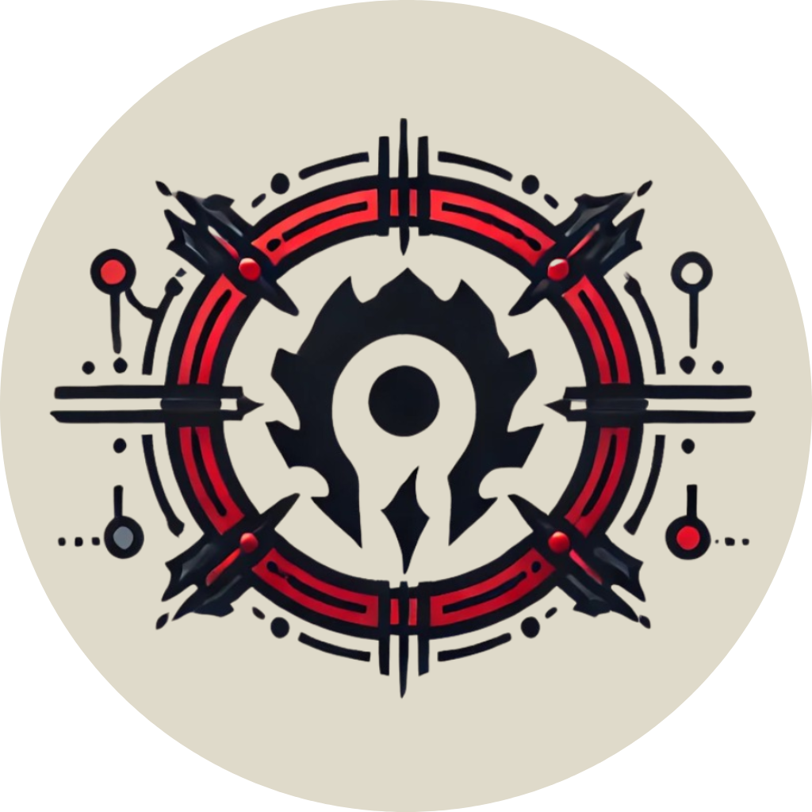

    
    &nbsp;
    <h1>Horde</h1>
    

        Horde is a suite of binary analysis tools for reverse engineering made in Rust with Python bindings. It aims to ease the analysis, modifying and generation of binary programs with various techniques.
    

    

        
        
    

    

        
        
    

## 📍 Overview

Horde is a comprehensive suite of binary analysis tools designed for reverse engineering, developed in Rust with Python bindings. It simplifies tasks like analyzing, modifying, and generating binary programs through various advanced techniques. Inspired by projects like [angr](https://github.com/angr/angr) and [miasm](https://github.com/cea-sec/miasm), Horde aims to streamline complex reverse engineering workflows for a wide range of architectures.

### 🚀 Motivations

This project is motivated by the need to unify diverse binary analysis utilities into a **cohesive**, **extensible** framework.

Unlike existing tools that often specialize in specific areas, Horde integrates capabilities like intermediate representation (via [GTIRB](https://github.com/grammatech/gtirb)), dynamic program instrumentation (with [Intel Pin](https://www.intel.com/content/www/us/en/developer/articles/tool/pin-a-dynamic-binary-instrumentation-tool.html)), symbolic execution (using [Triton](https://github.com/JonathanSalwan/Triton)), and disassembly (leveraging [ddisasm](https://github.com/GrammaTech/ddisasm/), [souffle](https://github.com/souffle-lang/souffle) and [capstone](https://github.com/capstone-engine/capstone)) under a single ecosystem, without reinventing the wheel.

Its innovative approach lies in offering a seamless interface in Rust and Python, with plans to expand bindings to other languages, enabling flexibility and accessibility for developers and researchers. By merging these powerful tools, Horde minimizes the fragmentation of reverse engineering workflows, offering a centralized and efficient solution for tasks ranging from binary rewriting to advanced program analysis.

This integration, coupled with Rust's performance and safety guarantees, makes Horde a compelling choice for anyone seeking a modern and versatile reverse engineering framework.

### 📦 Features

To-do

## 🧩 Contributing

We welcome contributions to Horde and are excited to have you involved! Whether you're fixing a bug, implementing a new feature, or improving documentation, your contributions make the project better.

Start by checking the issues to see if there's something you'd like to work on, or suggest your own ideas by opening a new issue. Please follow the established coding style and provide tests where applicable to ensure stability and maintainability. If you're adding a new feature, include documentation to help users understand and use your addition. For larger changes, consider opening a discussion or submitting a draft pull request to gather feedback early.

Thank you for helping make Horde a robust and innovative tool for the reverse engineering community!

## 🔗 Credits

To-do

## Statistics

<a href="https://next.ossinsight.io/widgets/official/compose-last-28-days-collaborative-productivity?repo_id=809304230" target="_blank" style="display: block" align="center">
  <picture>
    <source media="(prefers-color-scheme: dark)" srcset="https://next.ossinsight.io/widgets/official/compose-last-28-days-collaborative-productivity/thumbnail.png?repo_id=809304230&image_size=auto&color_scheme=dark" width="400" height="auto">
    
  </picture>
</a>

<a href="https://next.ossinsight.io/widgets/official/compose-contributors?repo_id=809304230&limit=20" target="_blank" style="display: block" align="center">
  <picture>
    <source media="(prefers-color-scheme: dark)" srcset="https://next.ossinsight.io/widgets/official/compose-contributors/thumbnail.png?repo_id=809304230&limit=200&image_size=auto&color_scheme=dark" width="400" height="auto">
    
  </picture>
</a>

<a href="https://next.ossinsight.io/widgets/official/compose-activity-trends?repo_id=809304230" target="_blank" style="display: block" align="center">
  <picture>
    <source media="(prefers-color-scheme: dark)" srcset="https://next.ossinsight.io/widgets/official/compose-activity-trends/thumbnail.png?repo_id=809304230&image_size=auto&color_scheme=dark" width="800" height="auto">
    
  </picture>
</a>
